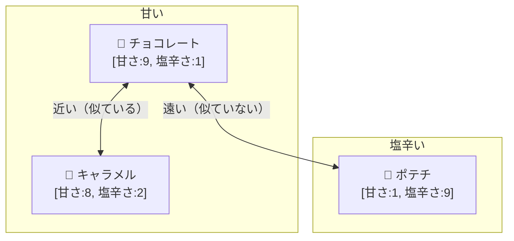
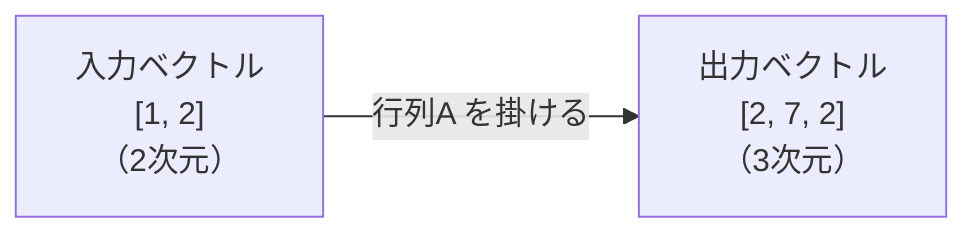
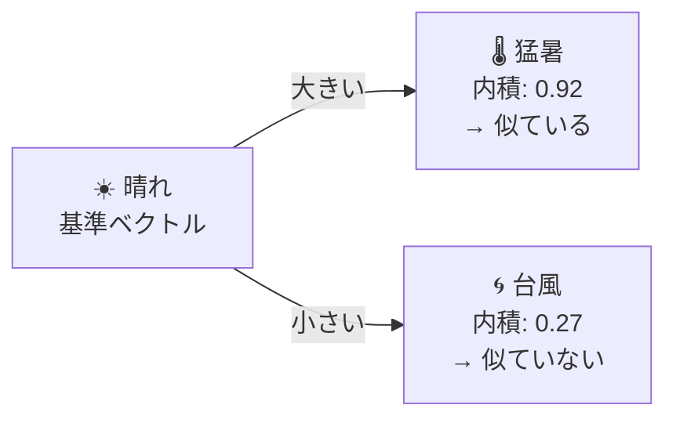
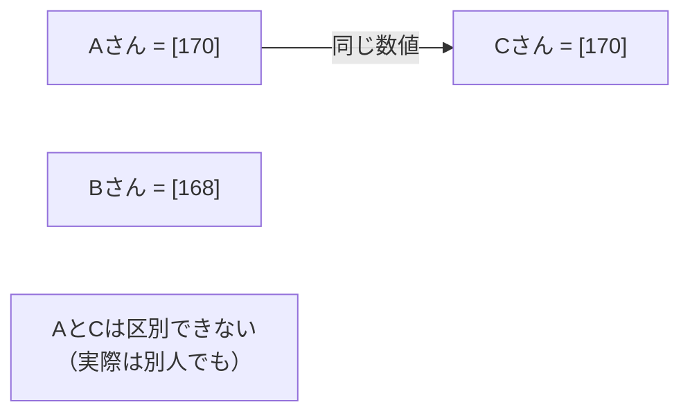
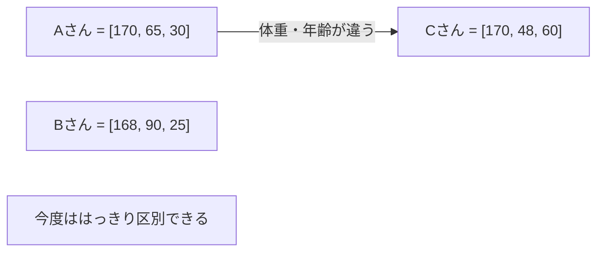
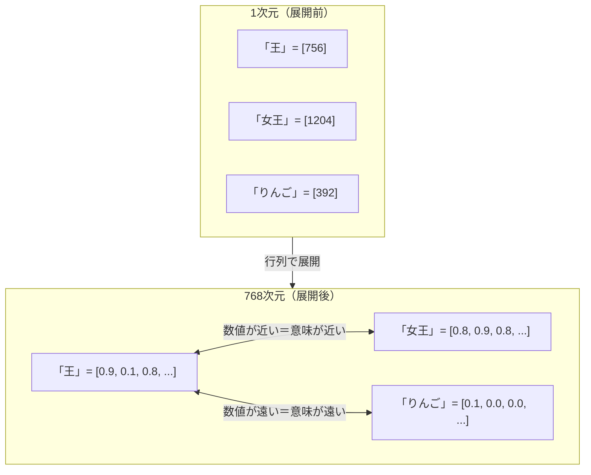
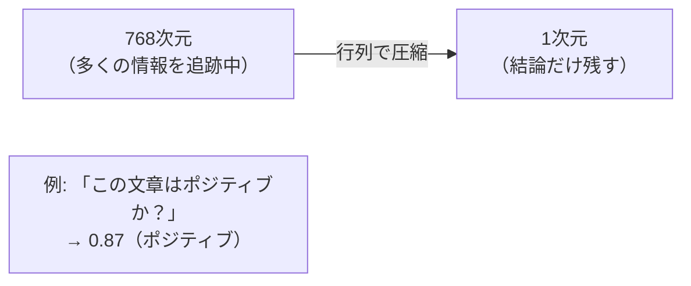
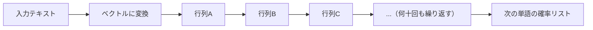

# ベクトルと行列の直感 ── LLMの計算はほぼこれだけ

> シリーズ「LLMの中身を数式で追う」第1回

---

前回、LLMは「行列の掛け算の連鎖」だと書いた。  
では「行列」とは何か。今回はそこを丁寧に見ていく。

---

## ベクトル ── 「複数の数値をひとまとめにしたもの」

まず、日常の例から始める。

ある人の情報を記録したいとする。

```
身長: 170 cm
体重:  65 kg
年齢:  30 歳
```

これを1つにまとめて書くと：

```
[170, 65, 30]
```

これが**ベクトル**だ。「複数の数値をひとまとめにした配列」。プログラマーなら `float[]` と同じ。

### ベクトルは「場所」を表す

ベクトルを使うと「空間の中の位置」を表せる。

2つの軸（甘さ・塩辛さ）で食べ物を表してみる。



```
チョコレート = [甘さ:9, 塩辛さ:1]
キャラメル   = [甘さ:8, 塩辛さ:2]
ポテチ       = [甘さ:1, 塩辛さ:9]
```

グラフを見ると、チョコとキャラメルは**近い**。ポテチは**遠い**。  
この「近さ・遠さ」がベクトルの重要な性質だ。

**LLMでは「単語の意味」をベクトルで表す。**  
「王」と「女王」のベクトルは近く、「王」と「りんご」は遠い。  
数百〜数千次元になるので図には描けないが、考え方はこれと同じだ。

---

## 行列 ── 「ベクトルを別のベクトルに変換する機械」

次に**行列**だ。行列とは数値を縦横に並べた表のこと。

```
A = [ 2  0 ]
    [ 1  3 ]
    [ 0  1 ]
```

これは3行2列の行列。

行列の役割は**「ベクトルを変換すること」**だ。  
「入力ベクトルを受け取って、別のベクトルを出力する」変換機だと思ってほしい。



### 行列とベクトルの掛け算を手で追う

`x = [1, 2]` というベクトルに、上の行列 `A` を掛けてみる。

計算ルールは「行列の各行と、入力ベクトルを内積する」だ。  
（内積は後で説明する。今は「掛けて足す」と覚えておけばいい）

```
A の1行目 [2, 0] と x = [1, 2] を掛けて足す:
  2×1 + 0×2 = 2

A の2行目 [1, 3] と x = [1, 2] を掛けて足す:
  1×1 + 3×2 = 7

A の3行目 [0, 1] と x = [1, 2] を掛けて足す:
  0×1 + 1×2 = 2
```

結果：

```
A × x = [2, 7, 2]
```

2次元のベクトル `[1, 2]` が、3次元のベクトル `[2, 7, 2]` に変換された。

**行列の役割は「次元を変換しながらベクトルを変える」こと。**  
LLMでは、単語の意味ベクトルが何十もの行列を通過して変換されていく。

---

## 内積 ── 「どれくらい似ているか」を1つの数値で測る

**内積（ドット積）** はとても重要な操作だ。

計算は単純。「対応する要素を掛けて、全部足す」だけ。

```
a = [1, 2, 3]
b = [4, 5, 6]

内積 = 1×4 + 2×5 + 3×6
     =   4 +  10 +  18
     = 32
```

### 内積が「似ている度合い」を表すのはなぜか

2つのベクトルが「同じ方向を向いている」ほど内積は大きくなる。  
「逆方向を向いている」と内積はマイナスになる。  
「直角（無関係）」だと内積はゼロになる。

具体例で確認する。

```
「晴れ」の日の特徴ベクトル = [気温高:0.9, 雨量低:0.1, 湿度低:0.2]
「猛暑」の特徴ベクトル     = [気温高:1.0, 雨量低:0.0, 湿度低:0.1]
「台風」の特徴ベクトル     = [気温高:0.3, 雨量低:0.0, 湿度低:0.0]
                                          ↑ここは雨量多いはずなので低くなる
```

```
「晴れ」と「猛暑」の内積:
  0.9×1.0 + 0.1×0.0 + 0.2×0.1 = 0.9 + 0.0 + 0.02 = 0.92  ← 大きい（似ている）

「晴れ」と「台風」の内積:
  0.9×0.3 + 0.1×0.0 + 0.2×0.0 = 0.27 + 0.0 + 0.0 = 0.27  ← 小さい（似ていない）
```

数値として「似ているか」が取り出せた。



**LLMの Attention という仕組みは、この内積を使って「どの単語に注目するか」を決めている。**  
詳しくは後の回で扱う。

---

## なぜ次元を変換する必要があるのか

行列がベクトルの次元を変える理由は「追いかける情報の数を変えるため」だ。

**次元 ＝ 同時に追いかける情報の数** と考えると分かりやすい。

### 次元が少ないと区別できない

友達を「身長だけ（1次元）」で管理するとする。



身長・体重・年齢の3次元にすると：



次元を増やす ＝ **より細かく区別できるようになる。**

### 単語IDを展開する理由

単語 `"王"` はコンピュータの中では整数1個 `[756]` にすぎない。  
これは「756番目の単語」という意味しかなく、意味の近さを表せない。



768次元では「権威っぽさ」「女性っぽさ」「生き物っぽさ」など  
768個の軸を同時に追いかけている。これで初めて「意味の近さ」が表現できる。

### 圧縮する理由

逆に次元を減らすのは「本質だけ絞り出すため」だ。



LLMの計算は「展開して複雑なパターンを見つけ、圧縮して本質を絞り出す」を繰り返している。

---

## 「掛けて足す」を何度も繰り返す

LLMの計算の全体像はこうだ。



この行列の変換を何十回も繰り返す。  
各行列の中の数値（重み）が「学習」によって調整されたものだ。

---

## まとめ

| 概念 | 正体 | 一言でいうと |
|---|---|---|
| ベクトル | 数値の配列 | 「意味」を数値の座標で表したもの |
| 行列 | 数値の2次元配列 | ベクトルを変換する機械 |
| 行列積 | 行と列を掛けて足す操作 | LLMの全計算の基本単位 |
| 内積 | 対応要素を掛けて合計 | 2つのベクトルの「似ている度合い」 |

次回は、この行列を使って「学習」が何をしているのかを見る。  
`y = f(Wx + b)` という式が、ニューラルネットの全ての出発点だ。

---

## 参考文献

| # | 文献 |
|---|---|
| [1] | 3Blue1Brown, "Essence of Linear Algebra" — [youtube.com/playlist](https://www.youtube.com/playlist?list=PLZHQObOWTQDPD3MizzM2xVFitgF8hE_ab)（行列とベクトルの視覚的理解。無料・英語字幕あり） |
| [2] | Mikolov et al., "Efficient Estimation of Word Representations in Vector Space", 2013 — [arxiv.org/abs/1301.3781](https://arxiv.org/abs/1301.3781)（単語をベクトルで表現するWord2Vecの原論文） |

---

*archforge_labs — LLMの中身を数式で追うシリーズ*
